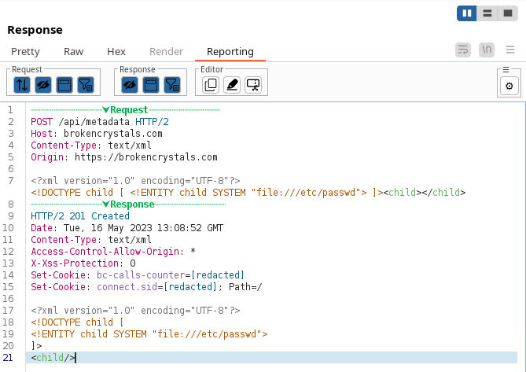

# Report Helper

Report Helper is a Burp Suite extension that makes it easy to include clean, readable HTTP requests and responses in pentest reports.
Instead of relying on screenshots, which are often difficult to read, you can copy and paste syntax-highlighted text straight into your report.

It also makes it easy to:
- Automatically redact Cookie and Authorization header values, or any selected text.
- Choose which headers to remove by default.



## Installation

You can either use a pre-built binary or build it yourself.

### Pre-built Binary

Download the latest pre-built binary from the [tags](https://github.com/maa-x/Report-Helper/releases).

### Building the Plugin

1. Ensure you have Maven installed on your machine.
   
2. Clone the repository:
   ```
   git clone https://github.com/maa-x/Report-Helper
   cd report-helper
   ```

3. Build the JAR using Maven:
   ```
   mvn clean install
   ```

4. This will generate a `reporterr.jar` file in the `target` directory.

### Loading the Plugin in BurpSuite

1. Open BurpSuite.
2. Navigate to the `Extender` tab and then the `Extensions` sub-tab.
3. Click on `Add` and select the `reporterr.jar` file you generated using Maven.
4. Once loaded, you'll see the Report Helper toolbar and text area in the BurpSuite interface.

## Usage

### Keyboard Shortcuts

| Action                                    | Shortcut          |
|-------------------------------------------|-------------------|
| Select All                                | `Ctrl + A`        |
| Copy                                      | `Ctrl + C`        |
| Undo                                      | `Ctrl + Z`        |
| Redo                                      | `Ctrl + X`        |
| Redact                                    | `Ctrl + Shift + C`|
| Snip                                      | `Ctrl + Shift + S`|

## Acknowledgments

- [Pentest Ltd.](https://pentest.co.uk/) for supporting the development of this plugin and giving me the time to build it.
- [RSyntaxTextArea](https://github.com/bobbylight/RSyntaxTextArea)
- Icons by:
   - [Smashingstocks](https://www.flaticon.com/authors/smashingstocks) from www.flaticon.com
   - [Pixel perfect](https://www.flaticon.com/authors/pixel-perfect) from www.flaticon.com
   - [Arkinasi](https://www.flaticon.com/authors/arkinasi) from www.flaticon.com

## Authors

Max de Dumast, Pentest Ltd.
